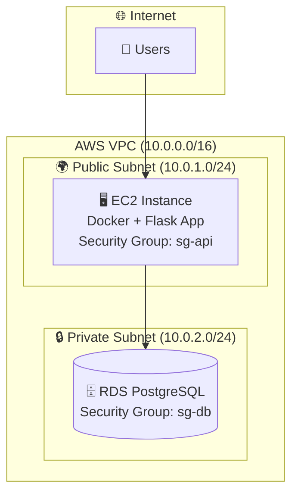
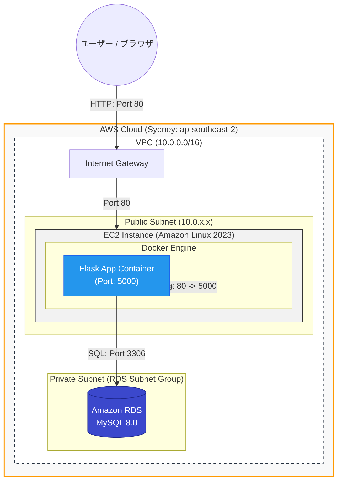
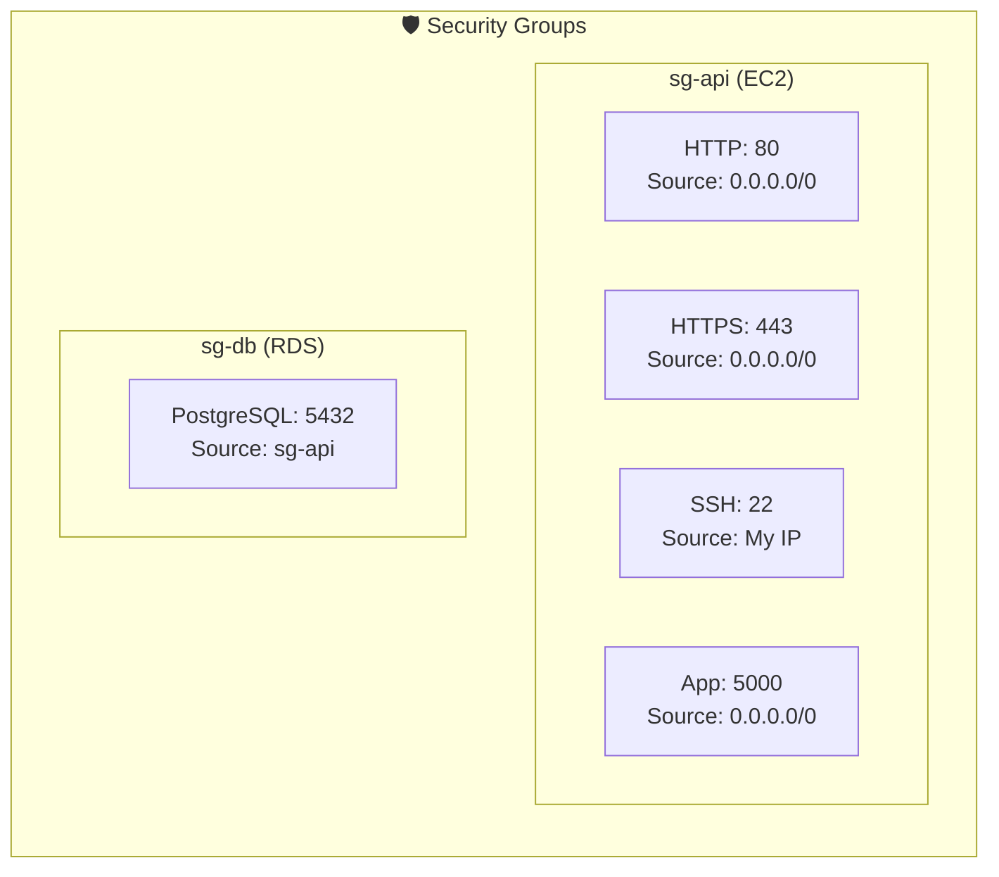
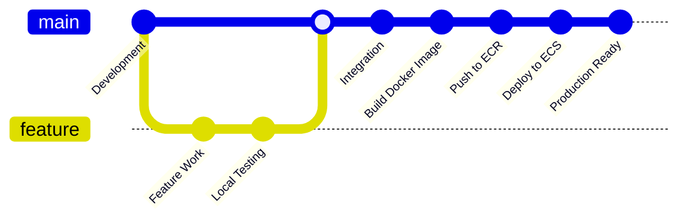
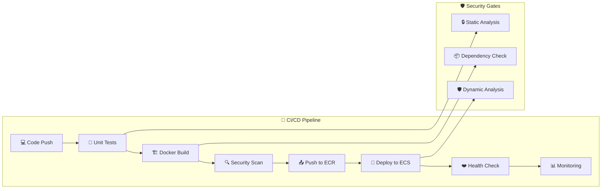
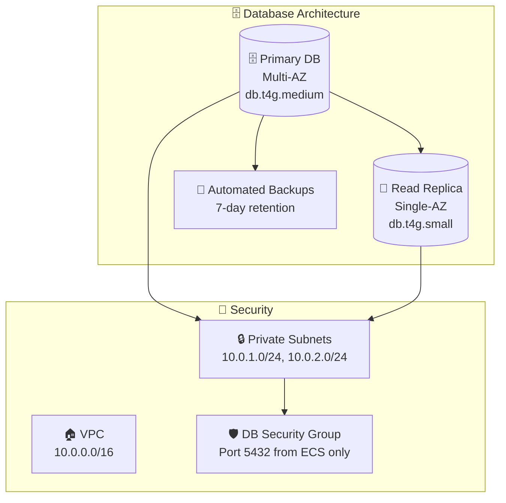

# FE Master - AWS デプロイメント

## 🏗️ システムアーキテクチャ

### AWS デプロイメント構成






### セキュリティグループ構成



## 📋 AWS デプロイメント手順

### 1. 事前準備

```bash
# AWS CLI設定
aws configure

# キーペア作成（EC2接続用）
aws ec2 create-key-pair --key-name fe-master-key --query 'KeyMaterial' --output text > fe-master-key.pem
chmod 400 fe-master-key.pem
```


## 🔄 デプロイメントフロー

### 自動デプロイメント

```bash
# デプロイスクリプト例（deploy.sh）
#!/bin/bash
set -e

# 1. コードの更新
ssh -i fe-master-key.pem ec2-user@$EC2_PUBLIC_IP "cd FE-master && git pull origin main"

# 2. Dockerイメージの再ビルド
ssh -i fe-master-key.pem ec2-user@$EC2_PUBLIC_IP "cd FE-master && docker-compose -f docker-compose.prod.yml build"

# 3. サービスの再起動
ssh -i fe-master-key.pem ec2-user@$EC2_PUBLIC_IP "cd FE-master && docker-compose -f docker-compose.prod.yml up -d"

# 4. ヘルスチェック
sleep 30
curl -f http://$EC2_PUBLIC_IP:5000/ || exit 1
echo "デプロイメント完了!"
```


## 🚀 クイックスタート

### 開発環境
```bash
# 1. リポジトリクローン
git clone https://github.com/your-username/FE-master.git
cd FE-master

# 2. Docker起動
docker-compose up -d

# 3. アクセス
open http://localhost:5000
```

### AWS本番環境（一括実行）
```bash
# 1. deploy-aws.shスクリプトを実行
chmod +x deploy-aws.sh
./deploy-aws.sh

# 2. 接続確認
curl http://EC2-PUBLIC-IP:5000
```

## 🔧 トラブルシューティング

### よくある問題

1. **EC2インスタンスに接続できない**
   ```bash
   # セキュリティグループ確認
   aws ec2 describe-security-groups --group-ids $API_SG_ID
   
   # SSH接続テスト
   ssh -i fe-master-key.pem ec2-user@$EC2_PUBLIC_IP
   ```

2. **RDSに接続できない**
   ```bash
   # RDS状態確認
   aws rds describe-db-instances --db-instance-identifier fe-master-db
   
   # セキュリティグループ確認
   aws ec2 describe-security-groups --group-ids $DB_SG_ID
   ```

3. **アプリケーションが起動しない**
   ```bash
   # Docker Composeログ確認
   ssh -i fe-master-key.pem ec2-user@$EC2_PUBLIC_IP "cd FE-master && docker-compose -f docker-compose.prod.yml logs"
   
   # 環境変数確認
   ssh -i fe-master-key.pem ec2-user@$EC2_PUBLIC_IP "cd FE-master && cat .env"
   ```

## 📝 メンテナンス

### 定期メンテナンス

```bash
# 1. バックアップ確認
aws rds describe-db-snapshots --db-instance-identifier fe-master-db

# 2. ログローテーション
ssh -i fe-master-key.pem ec2-user@$EC2_PUBLIC_IP "docker system prune -f"

# 3. セキュリティアップデート
ssh -i fe-master-key.pem ec2-user@$EC2_PUBLIC_IP "sudo yum update -y"
```

### スケーリング

```bash
# インスタンスタイプ変更
aws ec2 modify-instance-attribute \
  --instance-id $INSTANCE_ID \
  --instance-type Value=t3.small

# RDSスケールアップ
aws rds modify-db-instance \
  --db-instance-identifier fe-master-db \
  --db-instance-class db.t4g.small \
  --apply-immediately
```

## 💡 ベストプラクティス

### セキュリティ
- SSH接続は特定IPからのみ許可
- RDSは必ずプライベートサブネットに配置
- 定期的なセキュリティアップデート実施

### 可用性
- Multi-AZデプロイメント（コスト増）
- Auto Scalingの導入（トラフィック増加時）
- CloudWatchによる監視とアラート

### コスト最適化
- Reserved Instanceの利用
- 適切なインスタンスサイズの選択
- 不要なリソースの定期削除

---

> 📝 **注意**: 実際のデプロイメント前に、パスワードやドメイン名などの設定値を適切に変更してください。

## 📋 AWS デプロイメント手順

### 1. 事前準備

```bash
# AWS CLI設定
aws configure

# キーペア作成（EC2接続用）
aws ec2 create-key-pair --key-name fe-master-key --query 'KeyMaterial' --output text > fe-master-key.pem
chmod 400 fe-master-key.pem
```


## 🐳 Docker環境について

このプロジェクトはDocker化されており、以下の環境で動作可能です：
- ローカル開発環境（SQLite + Redis）
- AWS本番環境（PostgreSQL + ElastiCache）

### 🚀 クイックスタート

```bash
# 1. リポジトリをクローン
git clone https://github.com/d01ki/FE-master.git
cd FE-master

# 2. Dockerで起動
docker-compose up -d

# 3. ブラウザでアクセス
open http://localhost:5000
```

### 📁 ファイル構成

```
├── Dockerfile              # メインアプリケーション
├── docker-compose.yml      # 開発環境用構成
├── .dockerignore           # Dockerビルド除外設定
├── .env.docker            # Docker開発環境用変数
└── .env.aws.example       # AWS本番環境テンプレート
```

### � AWS デプロイメント戦略

### デプロイメントフロー



### CI/CD Pipeline



## 🔧 AWS 環境設定

### 1. ECR (Container Registry)
```bash
# ECRリポジトリ作成
aws ecr create-repository --repository-name fe-master

# Docker認証
aws ecr get-login-password --region us-east-1 | docker login --username AWS --password-stdin 123456789012.dkr.ecr.us-east-1.amazonaws.com
```

### 2. ECS クラスター構成

```yaml
# ecs-cluster.yml
Resources:
  ECSCluster:
    Type: AWS::ECS::Cluster
    Properties:
      ClusterName: fe-master-cluster
      CapacityProviders:
        - FARGATE
        - FARGATE_SPOT
      DefaultCapacityProviderStrategy:
        - CapacityProvider: FARGATE
          Weight: 1
        - CapacityProvider: FARGATE_SPOT
          Weight: 4
```

### 3. RDS データベース設定



