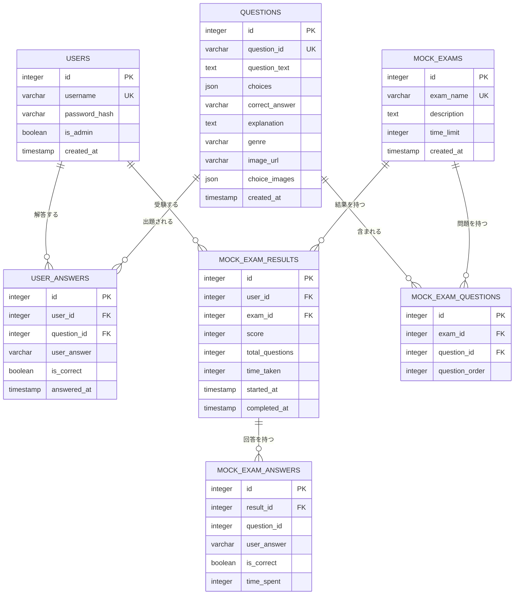
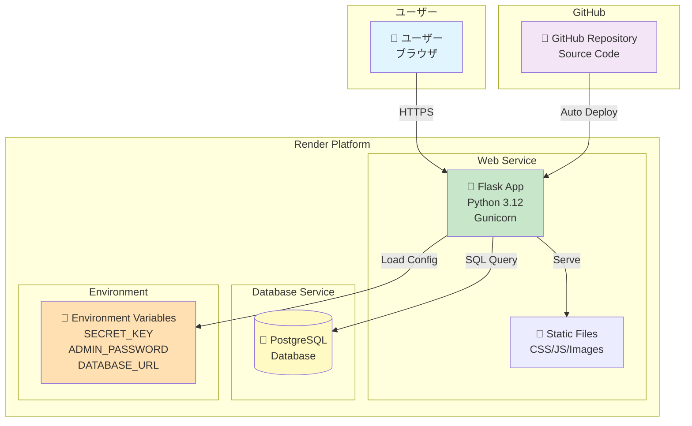
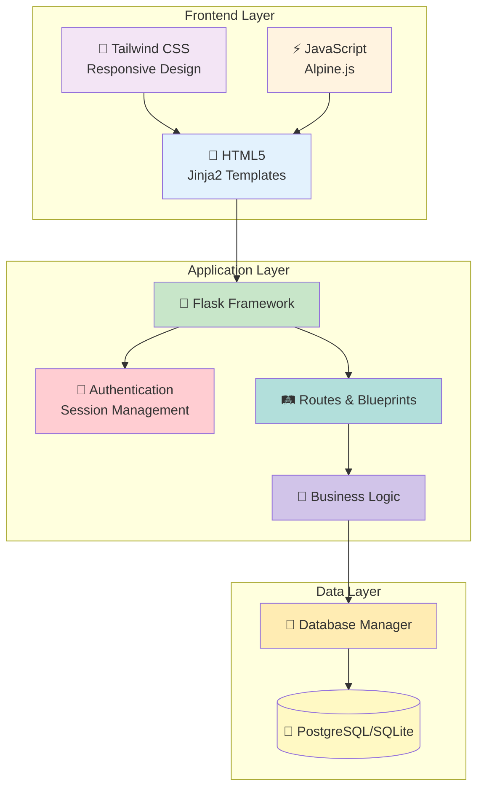
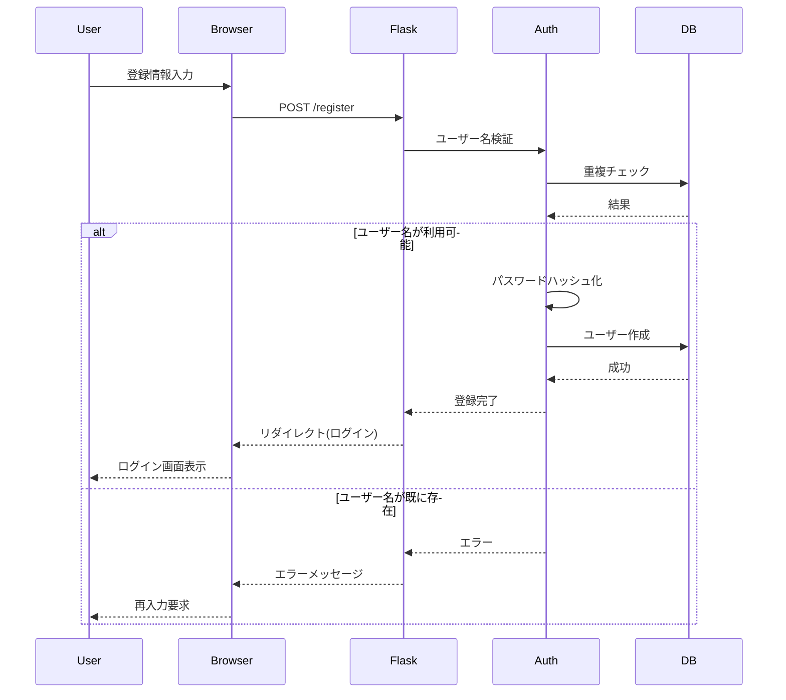
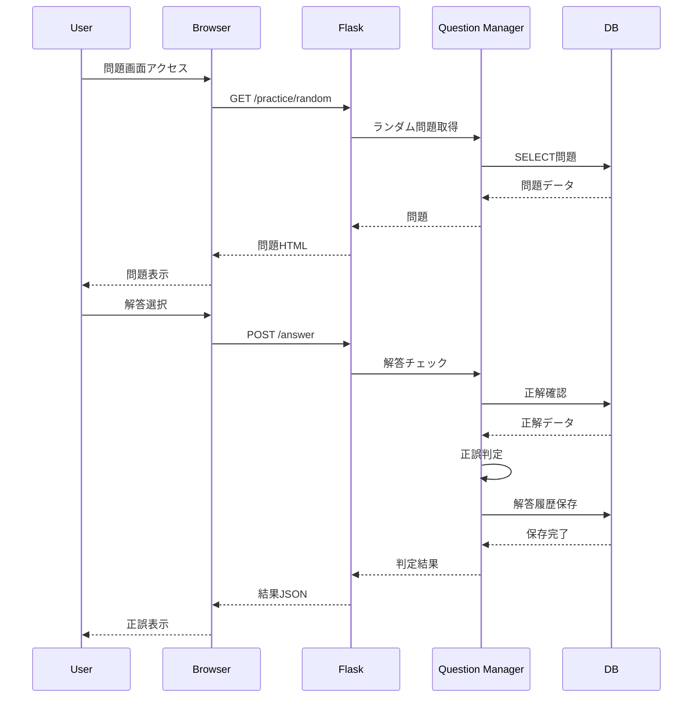
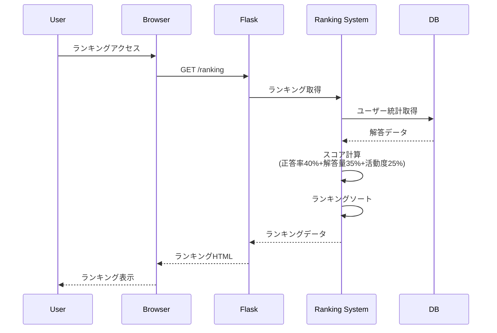
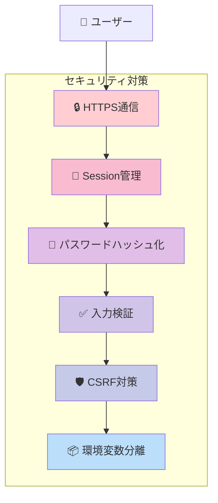
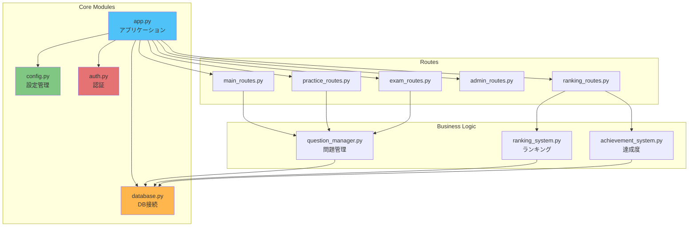
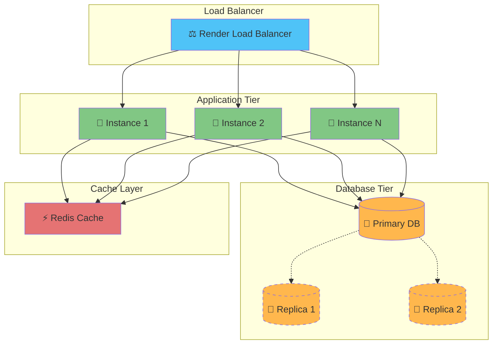

# 📊 システムダイアグラム

## E-R図 (Entity-Relationship Diagram)

### データベース構造

## インフラ構成図

### Renderデプロイ構成

## システムアーキテクチャ

## データフロー図

### ユーザー登録・ログインフロー

### 問題解答フロー

### ランキング計算フロー

## デプロイメントフロー

```mermaid
graph LR
    A["💻 Git Commit"] --> B["📤 Git Push"]
    B --> C["🐙 GitHub"]
    C --> D["🔔 Webhook"]
    D --> E["🔧 Render Build"]
    E --> F["📦 Install Dependencies"]
    F --> G["🗄️ Database Migration"]
    G --> H["🚀 Deploy"]
    H --> I["✅ Live Service"]

    style A fill:#e1f5fe
    style B fill:#f3e5f5
    style C fill:#fff3e0
    style D fill:#ffccbc
    style E fill:#c8e6c9
    style F fill:#b2dfdb
    style G fill:#ffecb3
    style H fill:#a5d6a7
    style I fill:#81c784
```

## セキュリティ層

## 機能モジュール図

## スケーリング構成（将来対応）

