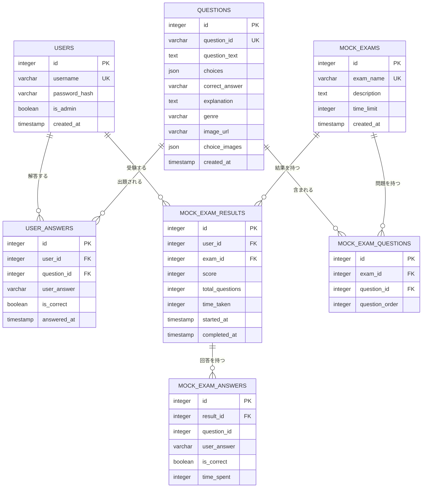
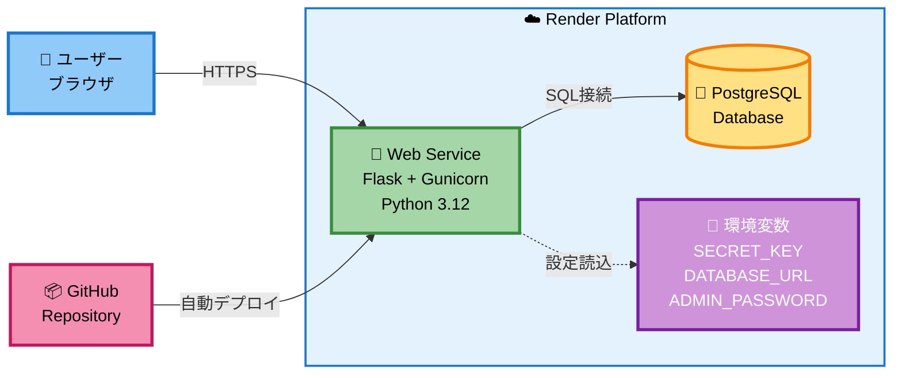
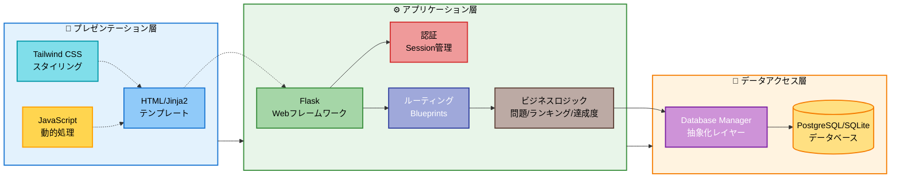

# 📊 システムダイアグラム

## E-R図 (Entity-Relationship Diagram)

### データベース構造

## インフラ構成図

### Renderデプロイ構成

## システムアーキテクチャ

### 3層アーキテクチャ構成

## 機能モジュール構成

```mermaid
flowchart LR
    subgraph Core["🎯 コアモジュール"]
        App["app.py<br/>エントリーポイント"]
        Config["config.py<br/>設定管理"]
    end
    
    subgraph Auth["🔐 認証"]
        AuthPy["auth.py<br/>認証処理"]
        DB["database.py<br/>DB接続"]
    end
    
    subgraph Logic["🧠 ビジネスロジック"]
        QM["question_manager.py<br/>問題管理"]
        RS["ranking_system.py<br/>ランキング"]
        AS["achievement_system.py<br/>達成度"]
    end
    
    subgraph Routes["🛤️ ルーティング"]
        Main["main_routes<br/>ダッシュボード"]
        Practice["practice_routes<br/>練習問題"]
        Exam["exam_routes<br/>過去問試験"]
        Admin["admin_routes<br/>管理画面"]
        Ranking["ranking_routes<br/>順位・達成度"]
    end
    
    App --> Config
    App --> Auth
    App --> Routes
    
    Routes --> Logic
    Logic --> DB
    Auth --> DB
    
    style App fill:#90CAF9,stroke:#1976D2,stroke-width:2px,color:#000
    style Config fill:#A5D6A7,stroke:#388E3C,stroke-width:2px,color:#000
    style AuthPy fill:#EF9A9A,stroke:#D32F2F,stroke-width:2px,color:#000
    style DB fill:#FFE082,stroke:#F57C00,stroke-width:2px,color:#000
    style QM fill:#CE93D8,stroke:#7B1FA2,stroke-width:2px,color:#fff
    style RS fill:#9FA8DA,stroke:#303F9F,stroke-width:2px,color:#fff
    style AS fill:#80DEEA,stroke:#0097A7,stroke-width:2px,color:#000
    style Main fill:#B39DDB,stroke:#512DA8,stroke-width:2px,color:#fff
    style Practice fill:#9FA8DA,stroke:#303F9F,stroke-width:2px,color:#fff
    style Exam fill:#81D4FA,stroke:#0277BD,stroke-width:2px,color:#000
    style Admin fill:#EF9A9A,stroke:#C62828,stroke-width:2px,color:#000
    style Ranking fill:#FFD54F,stroke:#F57C00,stroke-width:2px,color:#000
    style Core fill:#E3F2FD,stroke:#1976D2,stroke-width:2px,color:#000
    style Auth fill:#FFEBEE,stroke:#C62828,stroke-width:2px,color:#000
    style Logic fill:#F3E5F5,stroke:#7B1FA2,stroke-width:2px,color:#000
    style Routes fill:#E8F5E9,stroke:#388E3C,stroke-width:2px,color:#000
```

## テーブル説明

### 主要テーブル

| テーブル | 説明 | 主要カラム |
|---------|------|-----------|
| **USERS** | ユーザー情報 | username (ユニーク), password_hash, is_admin |
| **QUESTIONS** | 問題マスター | question_id (ユニーク), question_text, choices (JSON), correct_answer |
| **USER_ANSWERS** | 解答履歴 | user_id, question_id, is_correct, answered_at |
| **MOCK_EXAMS** | 過去問試験 | exam_name, description, time_limit |
| **MOCK_EXAM_RESULTS** | 試験結果 | user_id, exam_id, score, time_taken |

### リレーションシップ

- 1人のユーザーが複数の解答を持つ (1:N)
- 1つの問題が複数の解答を持つ (1:N)
- 1つの試験が複数の問題を持つ (M:N - MOCK_EXAM_QUESTIONS経由)
- 1つの試験結果が複数の解答詳細を持つ (1:N)

## システム技術スタック

### フロントエンド
- **HTML5 + Jinja2**: サーバーサイドテンプレート
- **Tailwind CSS**: ユーティリティファーストCSS
- **JavaScript (Vanilla)**: 動的UI制御

### バックエンド
- **Python 3.12**: プログラミング言語
- **Flask 2.3.3**: Webフレームワーク
- **Gunicorn**: WSGIサーバー

### データベース
- **PostgreSQL**: 本番環境 (Render)
- **SQLite**: 開発環境
- **カスタムORM**: データベース抽象化レイヤー

### デプロイ・インフラ
- **Render**: ホスティングプラットフォーム
- **GitHub**: ソースコード管理 & CI/CD
- **環境変数**: 機密情報管理
