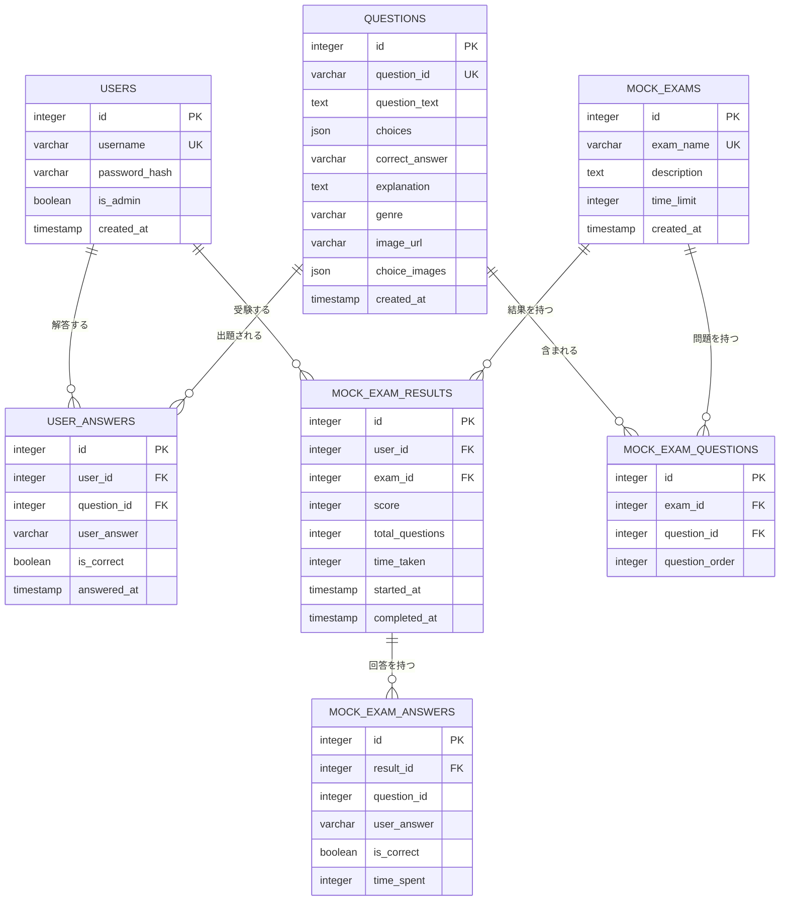
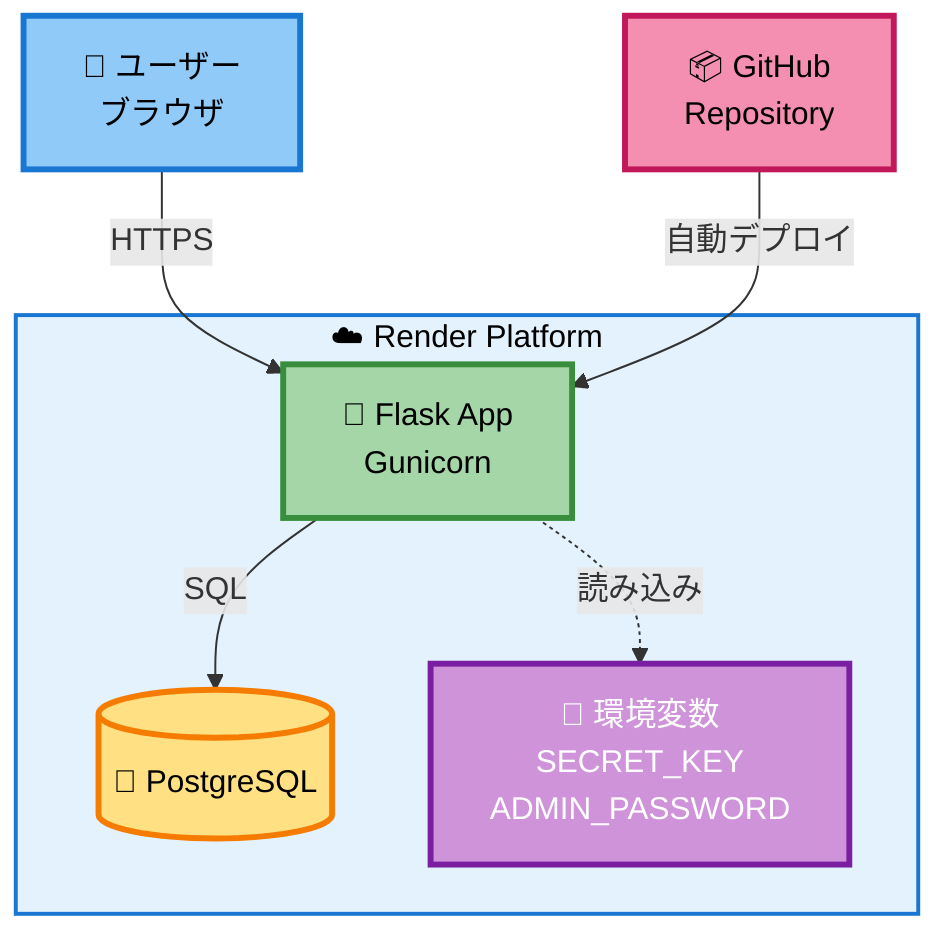
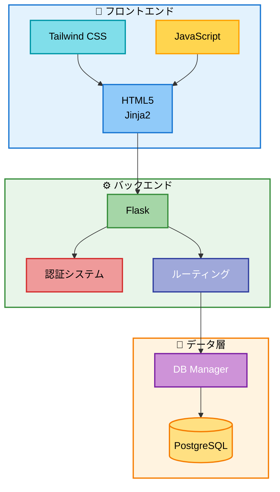
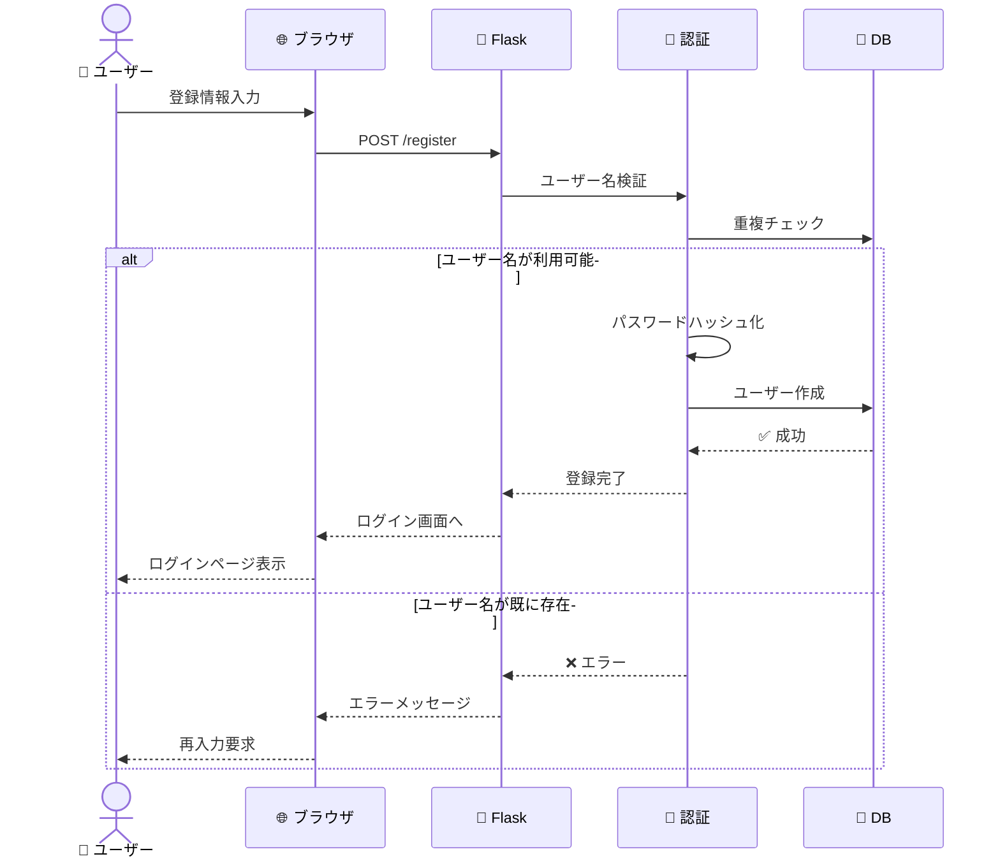
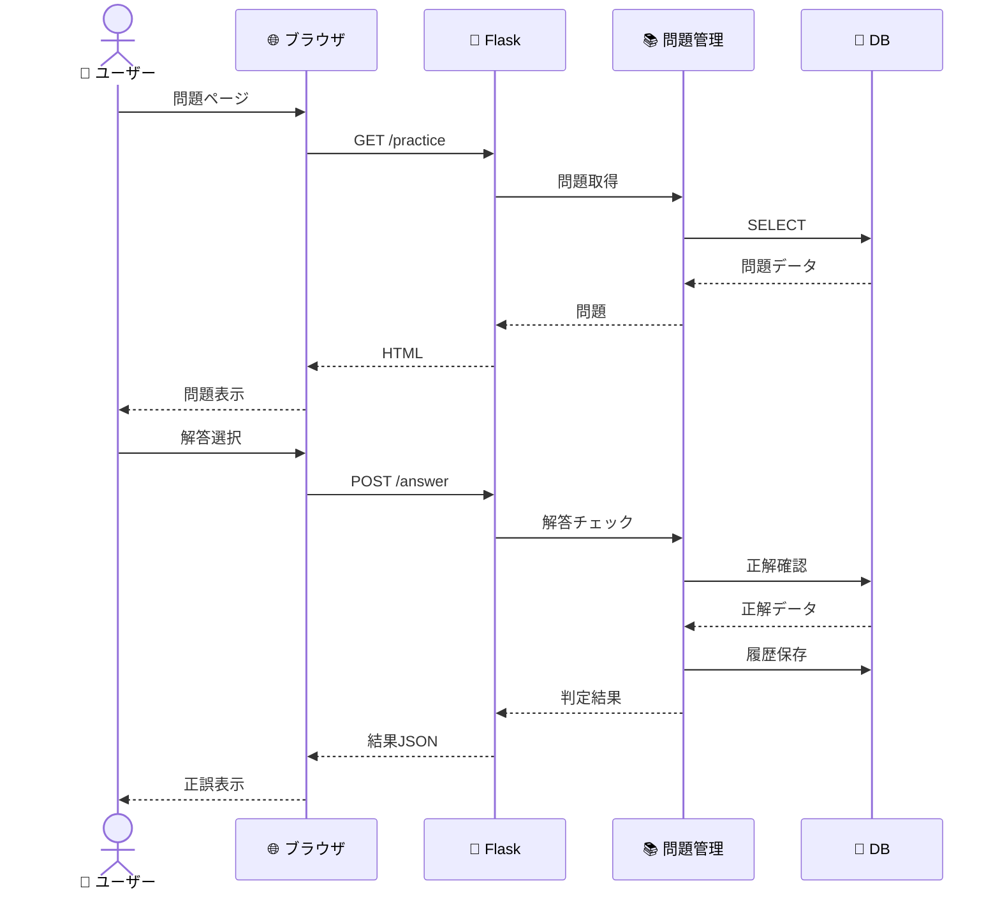
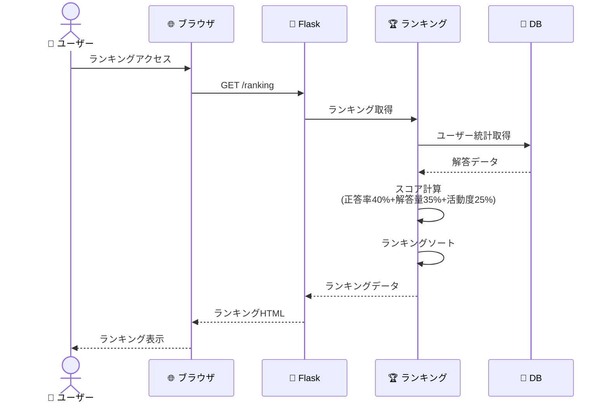
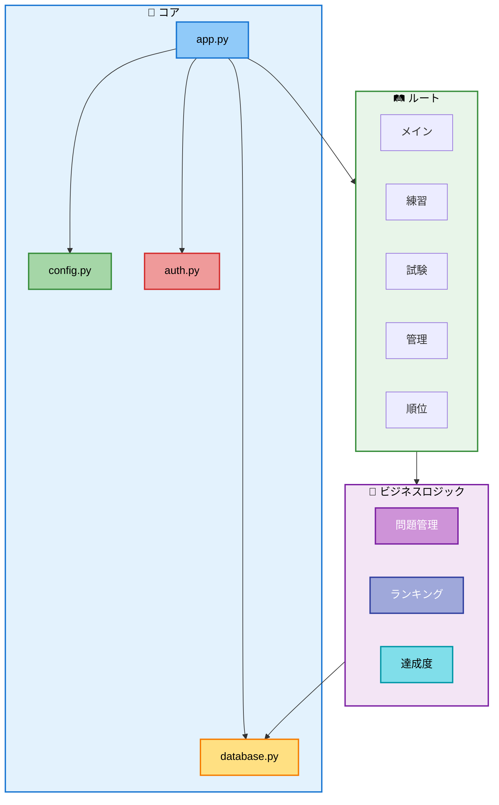
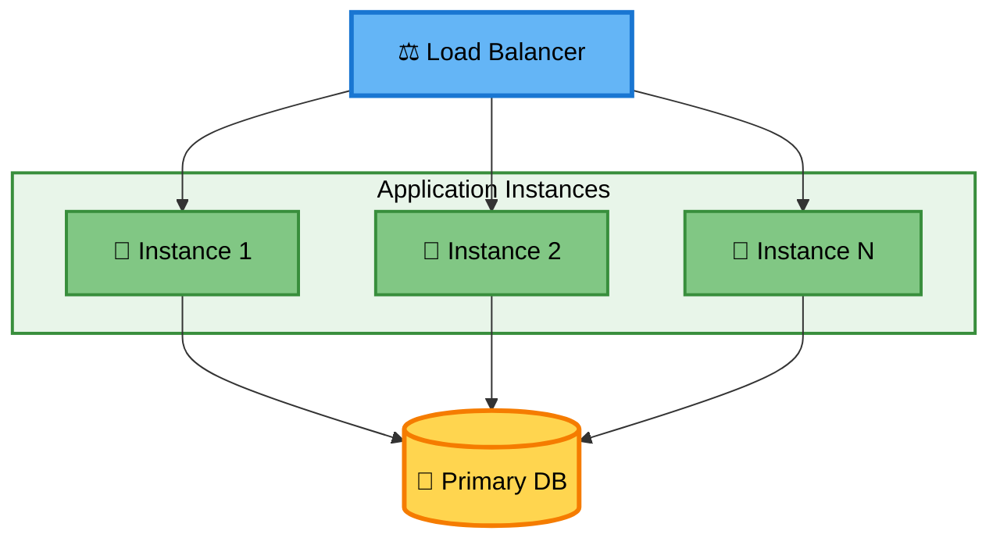

# 📊 システムダイアグラム

## E-R図 (Entity-Relationship Diagram)

### データベース構造

## インフラ構成図

### Renderデプロイ構成

## システムアーキテクチャ

## データフロー図

### ユーザー登録フロー

### 問題解答フロー

### ランキング計算フロー

## 機能モジュール図

## テーブル説明

### 主要テーブル

| テーブル | 説明 | 主要カラム |
|---------|------|-----------|
| **USERS** | ユーザー情報 | username (ユニーク), password_hash, is_admin |
| **QUESTIONS** | 問題マスター | question_id (ユニーク), question_text, choices (JSON), correct_answer |
| **USER_ANSWERS** | 解答履歴 | user_id, question_id, is_correct, answered_at |
| **MOCK_EXAMS** | 過去問試験 | exam_name, description, time_limit |
| **MOCK_EXAM_RESULTS** | 試験結果 | user_id, exam_id, score, time_taken |

### リレーションシップ

- 1人のユーザーが複数の解答を持つ (1:N)
- 1つの問題が複数の解答を持つ (1:N)
- 1つの試験が複数の問題を持つ (M:N - MOCK_EXAM_QUESTIONS経由)
- 1つの試験結果が複数の解答詳細を持つ (1:N)

## スケーリング構成（将来対応）

